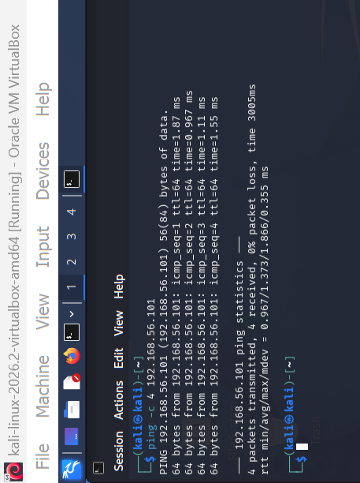
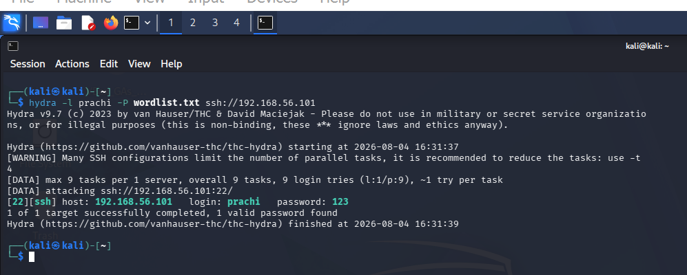
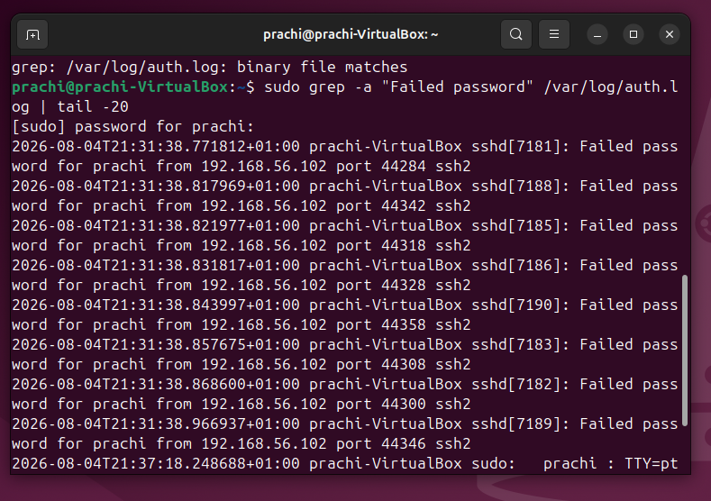
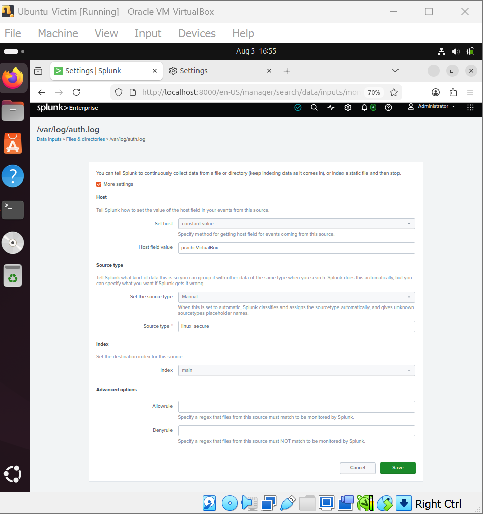
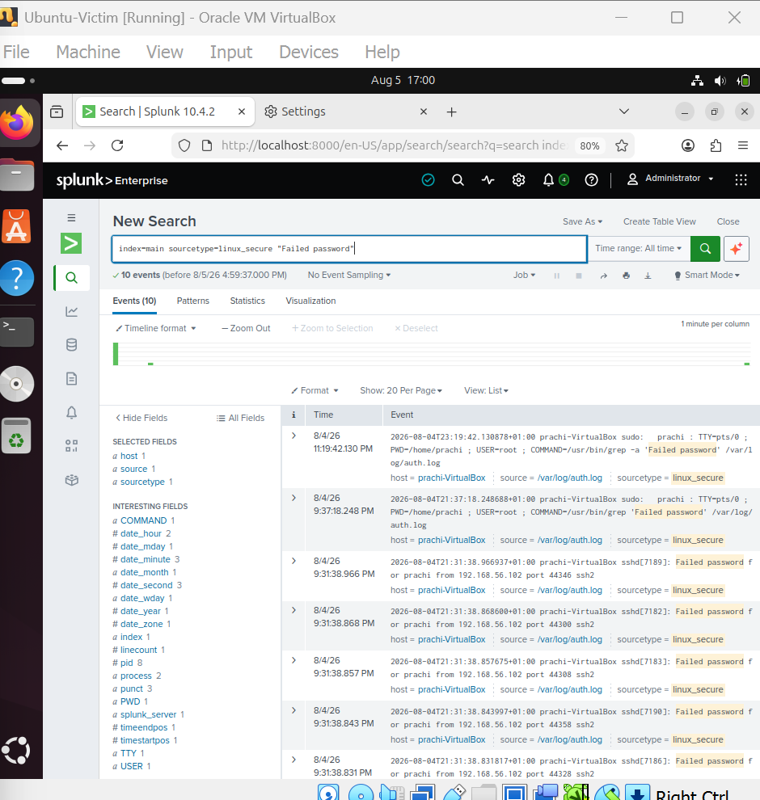
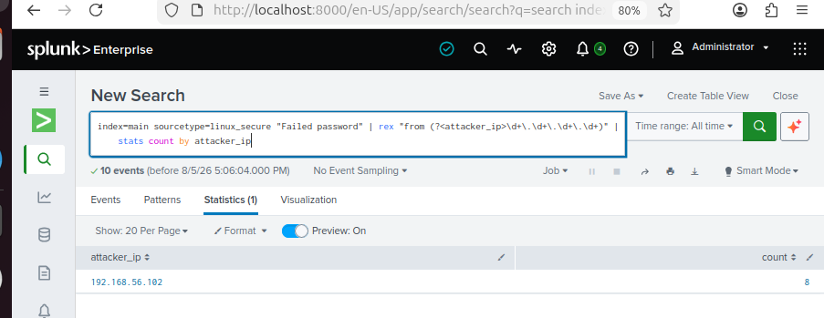
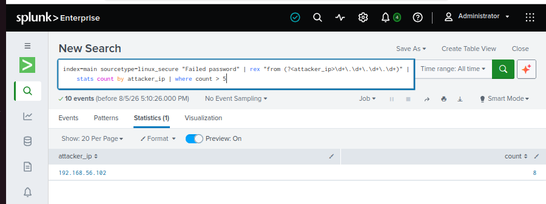
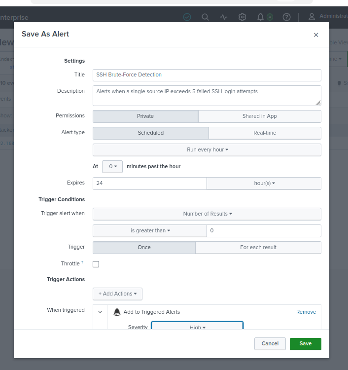
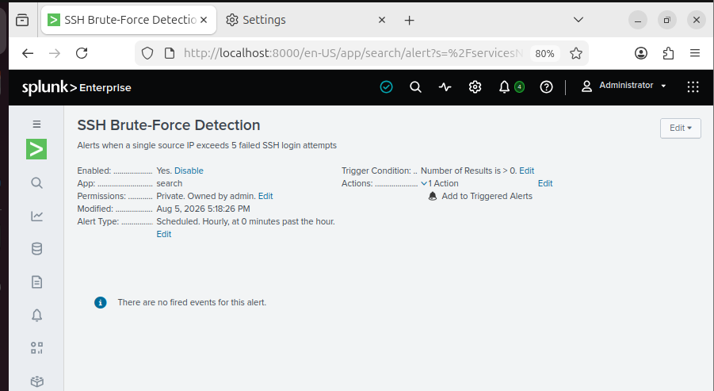

SOC Threat Detection Lab
Overview
This is a home lab where I simulated an SSH brute-force attack against a Linux machine and then detected it using Splunk. The aim was to go through the same steps a SOC analyst would follow: set up the environment, run the attack, get the logs into a SIEM, write a search to catch it, and then work out what the logs are actually telling you.
Tools Used
Kali Linux (attacker) - 192.168.56.102
Ubuntu 24.04 (target) - 192.168.56.101
Hydra for the brute-force
Splunk Enterprise as the SIEM
VirtualBox host-only network (192.168.56.0/24)
Lab Setup
Both machines run in VirtualBox on a host-only network, so nothing leaves the lab. Kali is the attacker and Ubuntu runs an OpenSSH server as the target. Splunk sits on the Ubuntu side and reads the local auth log.
Before doing anything else I checked the two machines could reach each other. Four ping replies, no packet loss.

Running the Attack
I used Hydra from Kali against the prachi account over SSH, with a small password wordlist:
```
hydra -l prachi -P wordlist.txt ssh://192.168.56.101
```
It finished in about two seconds and found the password:
```
[22][ssh] host: 192.168.56.101   login: prachi   password: 123
1 of 1 target successfully completed, 1 valid password found
```

The timing is the thing worth noticing. Nine login attempts in two seconds from one machine is not someone forgetting their password. That speed only comes from an automated tool.
Logs on the Target
On the Ubuntu side, every failed attempt lands in /var/log/auth.log. Filtering for failed passwords shows the whole burst coming from 192.168.56.102, each try hitting a different source port in the same second:
```
sudo grep -a "Failed password" /var/log/auth.log | tail -20
```

Getting the Logs into Splunk
I added the auth log to Splunk as a file input, set the sourcetype to linux_secure and the index to main, so the events become searchable.

Detection
A basic search pulls back all the failed password events:
```
index=main sourcetype=linux_secure "Failed password"
```

To make that useful I pulled the source IP out of each event and counted the failures per IP. That points straight at one attacker:
```
index=main sourcetype=linux_secure "Failed password"
| rex "from (?<attacker_ip>\d+\.\d+\.\d+\.\d+)"
| stats count by attacker_ip
```
8 failed logins, all from 192.168.56.102.

Then I added a threshold so the search only counts as a hit when the failures from one IP go past a set number. That stops a couple of genuine typos from setting anything off.

Alerting
I saved the search as a scheduled alert so this gets picked up automatically next time instead of me having to run the search myself.


What I Found
The prachi account was using a weak password (123) that a wordlist cracked instantly.
SSH was accepting password logins with no rate limiting and no lockout, so the attacker could try password after password with nothing slowing them down.
Everything came from one IP, 192.168.56.102, so once the detection was in place it was easy to pin down.
What I Would Fix
Use strong passwords, and ideally switch SSH to key-based login and turn password auth off.
Add fail2ban so an IP gets blocked after a set number of failures.
Limit SSH access to known addresses only.
Keep the Splunk alert running so repeat attempts get flagged on their own.
MITRE ATT&CK
T1110.001 - Brute Force: Password Guessing
